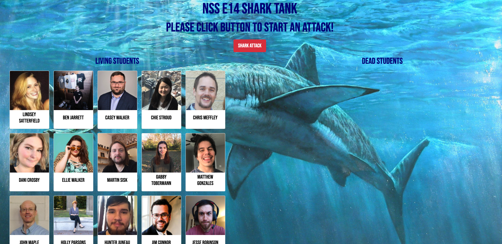
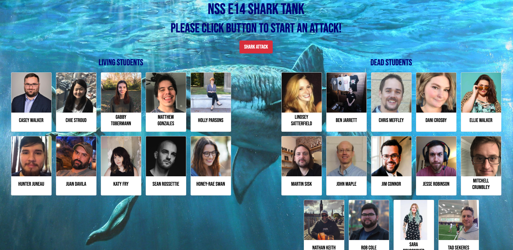

# Shark Attack

#### Overview
Shark Attack is an app that only the strongest Nashville Software School students of E14 survive! Clicking the button starts a shark attack where a random student is chosen to follow the light.
#### Deployed Project 
https://lindseysatterfield-shark-attack.netlify.app/

#### Project Board
https://github.com/lindseysatterfield/shark-attack/projects/1

#### Features
- Student chosen at random to be eaten by shark
- Student then moved to "Dead Students" column

#### Technologies
- React
- Vanilla JavaScript
- HTML
- CSS
- Reactstrap
- Sass
- Webpack

#### Screenshots

#### Contributors
[Lindsey Satterfield](https://github.com/lindseysatterfield)

#### Video Walkthrough
[Loom](https://www.loom.com/share/3867ca13ec7240a0a7556ed48597d63b)
